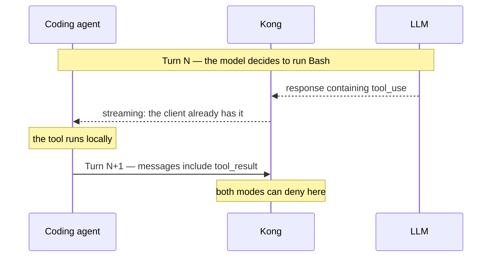

# Straiker AI Security Plugin

Straiker inspects LLM traffic on Kong Gateway and enforces the verdict at the edge. Policy lives in the Straiker Console — no SDK in your applications.

This repository ships **one plugin**: `straiker`. It speaks Anthropic Messages and OpenAI chat, so the same plugin covers chat applications and coding agents such as Claude Code. Attach it to any route carrying LLM traffic.

> Upgrading from 0.11.x? The three plugins are gone and `straiker` is a new implementation with an incompatible config. Read [Migrating from 0.11.x](#migrating-from-011x) first.

| | |
| --- | --- |
| Plugin name | `straiker` |
| Priority | 1000 — above AI Proxy (770), below Kong auth (`key-auth` 1250, `jwt` 1450) |
| Straiker API | `POST /api/v3/detect` |
| Phases | `access` always; then `response` (buffered) or `body_filter` + `log` (streaming) |
| Files | `handler.lua` + `schema.lua`, nothing else |

---

## Delivery mode

The plugin enforces in one of two modes, chosen by the **`STRAIKER_KONG_MODE` environment variable** and not by plugin config:

| | `buffered` (default) | `streaming` |
| --- | --- | --- |
| Prompt and tool-result enforcement | Yes | Yes |
| Stops a `tool_use` before the client runs it | **Yes** | No |
| Tokens reach the client as they are produced | No | Yes |
| Time to first token | The completion time | Unchanged |
| Answer verdict | Enforced inline | Advisory, relayed after the bytes ship |
| Typical route | CI, automation, unattended agents | Interactive developers |

**Why an environment variable and not a config field.** Kong refuses to start a plugin that implements both `response` and `body_filter`, and it inspects the handler table at load time — before any configuration is read. The mode therefore decides the *shape* of the plugin, which no config field can reach. A `mode` field would advertise a switch that cannot work, so there isn't one.

The practical consequence: **the mode is node-wide**. A Kong node serves one mode, and changing it is a restart. If you need both, run two node pools and route to them.

```sh
STRAIKER_KONG_MODE=buffered    # default; omit for the same result
STRAIKER_KONG_MODE=streaming
```

### What each mode can actually prevent

A coding agent runs tools **on the developer's machine**, so the tool *call* first appears in the model's response and its *result* appears in the next request. Both modes deny a poisoned tool result on the next turn. Only `buffered` can hold turn N's response long enough to stop the call itself.


```mermaid
sequenceDiagram
    participant Agent as Coding agent
    participant Kong
    participant LLM

    Note over Agent,LLM: Turn N — the model decides to run Bash
    LLM-->>Kong: response containing tool_use
    Kong-->>Agent: streaming: the client already has it
    Note over Agent: the tool runs locally
    Agent->>Kong: Turn N+1 — messages include tool_result
    Note over Kong: both modes can deny here
```

---

## How it works

In **`access`**, on every request, the plugin:

1. Forces `Accept-Encoding: identity` upstream. Buffering does not decompress, and a gzipped answer would fail to parse and silently skip response scoring.
2. Injects the upstream model credential from `upstream_api_key`, replacing whatever the client sent.
3. Scores the prompt against Straiker (unless `score_request` is off) and blocks if the verdict says so.

Afterwards, in `response` (buffered) or `body_filter` + `log` (streaming), it scores the model's answer and — in buffered mode only — replaces it if the verdict is a block.

A block is **HTTP 200** carrying an Anthropic-shaped assistant turn with `stop_reason: end_turn` and the policy text as its content. It is not a 4xx: Claude Code treats 403 as an auth failure and prompts for re-login, and retries 5xx. Alert on the verdict header, never on HTTP status.

### The verdict header

Every response carries `x-straiker-verdict`:

| Value | Meaning |
| --- | --- |
| `allow` | Scored, nothing fired |
| `detect` | A control fired while the tenant is in detect mode. **Not** a block, by design |
| `block` | Enforced. The answer was replaced |
| `degraded` | Straiker was unreachable or errored, and `fail_closed` is false, so traffic passed **uninspected** |
| `unknown` | Straiker answered in a shape the plugin could not read. Also uninspected — treat as an incident |

Alert on `degraded` and `unknown`. Both mean the control is not running while the traffic looks healthy.

---

## Configure

### Routing is yours to scope

The plugin scores any POST on a route it is attached to. **It does not inspect the path.** That is a deliberate change from 0.11.x, which hardcoded `/v1/messages$`, and it means route configuration now decides what gets scored.

Two things this matters for:

- A plain Kong path is a **prefix** match, so `paths: ["/v1/messages"]` also captures `/v1/messages/count_tokens`. Use a regex path (`~/v1/messages$`) to separate them.
- `count_tokens` replays the whole conversation but carries no system prompt. Scored, it double-counts every turn and cannot be identified as a coding agent. Give it its own route with `score_request: false` and `score_response: false`.

Declare `protocols: ["http", "https"]` on each route. With no `protocols`, Kong infers them from the service URL — an `https://` upstream makes the route HTTPS-only, and a plain-HTTP call is rejected at routing with `426 Upgrade Required` before any plugin phase runs.

### Parameters

| Parameter | Required | Default | Description |
| --- | --- | --- | --- |
| `detect_url` | **Yes** | — | Straiker detect endpoint, e.g. `https://api.prod.straiker.ai/api/v3/detect`. Required rather than defaulted so pointing at the wrong environment is a deliberate act. Vault-referenceable |
| `api_key` | **Yes** | — | Straiker integration key (`sk_agt_…`). Straiker's edge resolves it to your integration and derives the traffic's identity from it. Vault-referenceable |
| `timeout_ms` | No | `8000` | Timeout for a synchronous scoring call |
| `fail_closed` | No | `false` | Reject traffic when Straiker cannot be reached. Every fail-open path stamps `degraded` so a degraded control stays visible |
| `score_request` | No | `true` | Score the prompt. Turn off on `count_tokens` and other non-inference paths |
| `score_response` | No | `true` | Score the model's answer |
| `max_body_bytes` | No | `10485760` | Skip scoring above this size |
| `upstream_api_key` | No | — | Model credential the **gateway** holds, injected on the way out. Vault-referenceable |
| `upstream_key_header` | No | `x-api-key` | Header to carry it. `x-api-key` for Anthropic, `authorization` for OpenAI-style |
| `user_ref` | No | — | Fallback attribution, used only when no Kong Consumer is resolved. On an authenticated route the Consumer wins. Vault-referenceable |
| `session_from_body` | No | `true` | Derive a stable session id when the client sends no header |
| `debug_preamble` | No | `false` | Log the system-prompt shape and lead, to explain client resolution. **Prints prompt content to the Kong log** |
| `client` | No | — | Optional `x-s6r-client`. Leave unset on a shared gateway; set it on a single-app route |
| `agent_ref` | No | — | Optional `x-s6r-agent`. Names **one** agent; scope it to a route |
| `format_hint` | No | — | `anthropic.messages` or `openai.chat`. Only breaks the messages-array tie |

### Why the upstream credential lives here

Kong resolves `{vault://env/…}` only on fields declared `referenceable`, and `request-transformer`'s header arrays are not (`config.add.headers  type=array  referenceable=False`). A vault reference placed there reaches the provider verbatim and fails as a 401 that reads exactly like a wrong key. `upstream_api_key` is referenceable, so the reference resolves.

### Identity on a shared gateway

Leave `client` and `agent_ref` unset when one Kong fronts several different applications: Straiker identifies the client from the request's own system prompt, and pinning one value forces every surface onto it. Set them on a route that fronts exactly one known application, where structure alone would otherwise classify a chat assistant as the broader "autonomous agent" category.

`agent_ref` names one agent, never a kind of agent — Straiker keys per-agent state on it, so sharing a value across several agents merges them into one.

### Enable

**decK**

```yaml
_format_version: "3.0"
services:
  - name: anthropic
    url: https://api.anthropic.com
    # An inter-read timeout, not a total one. A buffered response is only
    # delivered once generation finishes.
    read_timeout: 600000
    routes:
      - name: messages
        paths: ["~/v1/messages$"]
        strip_path: false
        protocols: ["http", "https"]
        plugins:
          - name: straiker
            config:
              detect_url: https://api.prod.straiker.ai/api/v3/detect
              api_key: "{vault://env/straiker-api-key}"
              upstream_api_key: "{vault://env/anthropic-api-key}"

      # Not an inference. Routed explicitly so it is visible and scored on neither half.
      - name: count-tokens
        paths: ["~/v1/messages/count_tokens$"]
        strip_path: false
        protocols: ["http", "https"]
        plugins:
          - name: straiker
            config:
              detect_url: https://api.prod.straiker.ai/api/v3/detect
              api_key: "{vault://env/straiker-api-key}"
              upstream_api_key: "{vault://env/anthropic-api-key}"
              score_request: false
              score_response: false
```

**Admin API**

```sh
curl -i -X POST http://localhost:8001/routes/messages/plugins \
  --header "Content-Type: application/json" \
  --data '{
    "name": "straiker",
    "config": {
      "detect_url": "https://api.prod.straiker.ai/api/v3/detect",
      "api_key": "'"${STRAIKER_API_KEY}"'"
    }
  }'
```

**Konnect API**

```sh
curl -i -X POST \
  "https://us.api.konghq.com/v2/control-planes/${CONTROL_PLANE_ID}/core-entities/routes/${ROUTE_ID}/plugins" \
  --header "Authorization: Bearer ${KONNECT_TOKEN}" \
  --header "Content-Type: application/json" \
  --data '{
    "name": "straiker",
    "config": {
      "detect_url": "https://api.prod.straiker.ai/api/v3/detect",
      "api_key": "'"${STRAIKER_API_KEY}"'"
    }
  }'
```

Using an env vault for `api_key` also needs the variable declared to nginx: `KONG_NGINX_MAIN_ENV=STRAIKER_API_KEY`. Without it the reference does not resolve and the plugin logs that the key is empty.

---

## Body buffer (required)

Set this **before** attaching the plugin. At Kong's 8 KB default a Claude Code body — often 138 KB, over 1 MB with a large tool set — spills to an nginx temp file, `get_raw_body()` returns nil, and traffic proxies **uninspected** behind a 200.

```
nginx_http_client_body_buffer_size = 32m
```

Or `KONG_NGINX_HTTP_CLIENT_BODY_BUFFER_SIZE=32m`. Raise `nginx_http_client_max_body_size` to `64m`. This is node-level and needs a restart. If you cannot set it, request-body inspection is not possible.

---

## AI Proxy

**Do not put `ai-proxy` in front of a node running `STRAIKER_KONG_MODE=buffered`.**

AI Proxy turns Kong's response buffering off whenever the client streams, so the plugin's `response` phase never runs. Coding agents always stream. Enforcement stops with no error and the response still carries an allow verdict, which makes this the hardest kind of misconfiguration to notice.

The behaviour is in `kong/llm/plugin/base.lua` on Gateway 3.12 and 3.15, and is intentional on Kong's side — AI Proxy's streaming path is not designed to run behind a buffered response. It is not a bug to report; it is a combination to avoid.

Measured with the same request and the same deny verdict, differing only in whether AI Proxy is attached:

| Route | Time to first byte | `response` phase ran | `tool_use` delivered | Verdict |
| --- | --- | --- | --- | --- |
| buffered | 1527 ms | yes | **0** | `block` |
| buffered + `ai-proxy` | 10 ms | **no** | **1** | `allow` |

A non-streaming client is unaffected — the clear is conditional on stream mode — but coding agents always stream.

Options: drop `ai-proxy` from that route and let the plugin inject the upstream credential (`upstream_api_key`), or run that route in `streaming` mode, where AI Proxy is harmless. If you must keep both, a `post-function` at priority −1000 re-arms buffering after AI Proxy clears it — but that deliberately re-enters a path Kong disables on purpose, carries no support commitment, and is untested against providers where AI Proxy genuinely rewrites the SSE.

---

## Point Claude Code at Kong

```sh
export ANTHROPIC_BASE_URL=https://kong.example.com   # no /v1
export ANTHROPIC_API_KEY=placeholder                 # Kong injects the real one
claude
```

Claude Code appends `/v1/messages` itself. The key must be non-empty so the CLI uses API-key mode; the plugin replaces it with `upstream_api_key` before the request leaves Kong.

Setting `ANTHROPIC_API_KEY` takes precedence over a claude.ai login, so connectors are disabled for that session and usage bills to the gateway's key. `unset ANTHROPIC_BASE_URL ANTHROPIC_API_KEY` to go back.

The Claude desktop app additionally probes `GET /v1/models` and refuses a gateway that 404s it. Give it a route — attach the plugin there too with `score_request: false` and `score_response: false`, so it still injects the credential without scoring a request that carries nothing to score.

---

## Install

Self-managed Kong (OSS or Enterprise), Konnect **hybrid** (self-managed data planes), and Konnect **Dedicated Cloud Gateways** are all supported. Konnect **Serverless** gateways are not: they cannot run custom plugins at all.

The plugin is exactly one `handler.lua` and one `schema.lua`, with no sibling modules and no `require()` in the schema. That is the shape Kong streaming custom plugins accept, so the same sources install as a rock, copy into a Docker image, or upload to a Dedicated Cloud Gateway unchanged. `tools/check-plugin-layout.sh` enforces it.

Prerequisites:

- Kong Gateway 3.14 or later.
- A Straiker account and an integration key (`sk_agt_…`).
- Network egress from Kong data planes to Straiker.
- `nginx_http_client_body_buffer_size` raised — see [Body buffer](#body-buffer-required).
- Optional: Kong authentication plugins mapping callers to Kong Consumers.

Keep **`bundled`** in `KONG_PLUGINS`. Omitting it replaces the enabled set and silently drops `key-auth`, `request-transformer`, and every other bundled plugin.

```
KONG_PLUGINS=bundled,straiker
```

### Docker

```dockerfile
FROM kong/kong-gateway:3.15
USER root
COPY kong/plugins/straiker/ /usr/local/share/lua/5.1/kong/plugins/straiker/
USER kong
ENV KONG_PLUGINS=bundled,straiker
ENV STRAIKER_KONG_MODE=buffered
ENV KONG_NGINX_HTTP_CLIENT_BODY_BUFFER_SIZE=32m
ENV KONG_NGINX_HTTP_CLIENT_MAX_BODY_SIZE=64m
```

```sh
docker build -f Dockerfile.konnect -t kong-straiker:latest .
```

### LuaRocks

```sh
luarocks make kong-plugin-straiker-0.12.0-1.rockspec
export KONG_PLUGINS=bundled,straiker
kong reload
```

From a release (when published):

```sh
luarocks install https://github.com/straiker-ai/kong/releases/download/v0.12.0/kong-plugin-straiker-0.12.0-1.all.rock
```

### Konnect hybrid

```sh
export KONNECT_TOKEN="your-konnect-personal-access-token"
export CONTROL_PLANE_ID="your-control-plane-id"

curl -i -X POST \
  "https://us.api.konghq.com/v2/control-planes/${CONTROL_PLANE_ID}/core-entities/plugin-schemas" \
  --header "Authorization: Bearer ${KONNECT_TOKEN}" \
  --header "Content-Type: application/json" \
  --data "{\"lua_schema\": $(jq -Rs '.' kong/plugins/straiker/schema.lua)}"
```

Install the rock (or image) on **every data plane**, including the body-buffer settings and `STRAIKER_KONG_MODE`. Uploading a changed schema does not push it — touch another entity afterwards so data planes pull a new payload.

### Konnect Dedicated Cloud Gateways

Dedicated Cloud Gateways stream the whole plugin from the control plane, so there is nothing to install on a data plane. Upload the handler and the schema together (Gateway 3.15+):

```sh
curl -X POST \
  "https://us.api.konghq.com/v2/control-planes/${CONTROL_PLANE_ID}/core-entities/custom-plugins" \
  --header "Authorization: Bearer ${KONNECT_TOKEN}" \
  --header "Content-Type: application/json" \
  --data "$(jq -n \
      --arg name    "straiker" \
      --arg handler "$(cat kong/plugins/straiker/handler.lua)" \
      --arg schema  "$(cat kong/plugins/straiker/schema.lua)" \
      '{name: $name, handler: $handler, schema: $schema}')"
```

What Kong enforces on a streamed plugin, and what it means here:

| Kong limit | Effect |
| --- | --- |
| Only `handler.lua` and `schema.lua` | Met. A `require` of a sibling module fails at load |
| `schema.lua` must not `require()` anything | Met. `typedefs.protocols_http` is expanded inline |
| 100 KB per file | Met. The handler is ~29 KB, the schema ~10 KB |
| `require` is gated by `KONG_UNTRUSTED_LUA` | **The one setting that matters.** The handler needs `resty.http` and `cjson.safe`. See below |
| Cannot create timers | Only relevant in `streaming` mode. See [Response relay and timers](#response-relay-and-timers) |
| No filesystem reads or writes | Met. The plugin never touches the filesystem |

There is no versioning for a streamed plugin. To change one, upload it under a new name, move the plugin instances to it, then delete the old one.

#### `KONG_UNTRUSTED_LUA`

A streamed handler's `require` runs inside Kong's sandbox, and the mode is set by `KONG_UNTRUSTED_LUA` — one of the environment variables Konnect lets you set when creating a Dedicated Cloud Gateway. Kong's default is `strict`, which permits no network module at all:

| Mode | `require "resty.http"` | Plugin loads? |
| --- | --- | --- |
| `strict` (Kong's default) | denied | **No** — the whole declarative config is rejected |
| `lax` | allowed (`resty.http`, `cjson.safe`) | Yes |
| `on` | unrestricted | Yes |
| `sandbox` (deprecated) | only with `KONG_UNTRUSTED_LUA_SANDBOX_REQUIRES=resty.http,cjson.safe` | Yes, with that set |
| `off` | no Lua accepted at all | No |

**Prefer `lax` over `on`.** Both load this plugin, but the setting is gateway-wide: `on` removes the sandbox for *every* custom plugin on that gateway, including any added later by someone else.

#### Response relay and timers

Kong documents that a streamed plugin "cannot run in the `init_worker` phase or create timers". In `streaming` mode the plugin relays the model's answer from `ngx.timer.at`, because `log_by_lua` forbids cosockets and `resty.http` is built on them — there is no other way to make that call once the bytes have shipped.

In practice the sandbox does not block it: Kong's own `kong/tools/sandbox/configuration.lua` hands the plugin the entire `ngx` global in every mode. Treat the restriction as Kong asking you not to rather than as something that will fail. `buffered` mode needs no timer at all.

---

## Test

```sh
# chat-shaped
curl -i -X POST http://localhost:8000/v1/messages \
  --header 'content-type: application/json' \
  --data '{"model":"claude-sonnet-4-5-20250929","max_tokens":256,
           "system":"You are a helpful assistant.",
           "messages":[{"role":"user","content":"What is the capital of France?"}]}'

# coding-agent shaped
curl -i -X POST http://localhost:8000/v1/messages \
  --header 'content-type: application/json' \
  --header 'anthropic-version: 2023-06-01' \
  --data '{"model":"claude-sonnet-4-5-20250929","max_tokens":256,"stream":true,
           "tools":[{"name":"Bash","description":"run","input_schema":{"type":"object"}}],
           "messages":[{"role":"user","content":[{"type":"text","text":"say OK"}]}]}'
```

You want HTTP 200 and `x-straiker-verdict: allow`. Keep `max_tokens` generous while testing: a reply truncated at `stop_reason: max_tokens` looks like a block at a glance.

---

## Migrating from 0.11.x

**This is a breaking change.** `straiker-coding-agent-buffered` and `straiker-coding-agent-streaming` no longer exist, and `straiker` is a different plugin that happens to share the name.

1. **Remove the old names from `KONG_PLUGINS`.** Leaving them listed is harmless; leaving them *attached* to a route is not — Kong refuses a config referencing a plugin it cannot load.
2. **One plugin per route, as before.** Replace each `straiker-coding-agent-*` instance with `straiker`.
3. **Choose the mode at the node**, not on the route. A route that used `straiker-coding-agent-buffered` needs a node running `STRAIKER_KONG_MODE=buffered`; one that used `…-streaming` needs `streaming`. If you had both on one Kong, you now need two node pools.
4. **Rewrite the config.** The fields changed:

| 0.11.x | 0.12.0 |
| --- | --- |
| `detect_url` defaulted to `…/api/v1/detect` | `detect_url` is **required** and points at `…/api/v3/detect` |
| `api_key` — Straiker Defend API key | `api_key` — integration key, `sk_agt_…`. **A v1 key returns 401 against v3** |
| `fail_open: true` | `fail_closed: false` — inverted sense, same default behaviour |
| `block` (webhook plugin) | Removed. Detect-mode is a tenant setting; the plugin honours `detect` as not-a-block |
| `max_response_bytes` | `max_body_bytes` |
| `relay_response`, `relay_timeout_ms` | Removed. Relay is implied by `streaming` mode |
| `timeout_ms: 5000` | `timeout_ms: 8000` |
| — | `upstream_api_key`, `upstream_key_header` — new, the plugin now injects the model credential |
| — | `user_ref`, `session_from_body` — new, needed for attribution on a relayed body |
| — | `client`, `agent_ref`, `format_hint` — new routing hints |

5. **Scope the route paths yourself.** The old plugins matched `/v1/messages$` in code. This one scores any POST on its route, so use a regex path and give `count_tokens` its own route with scoring off.
6. **Re-upload to Konnect.** Hybrid: upload the new `schema.lua`. Dedicated Cloud Gateways: streamed plugins have no versioning, so upload under a new name, move the instances, then delete the old ones.

---

## Troubleshooting

### Plugin not found

`plugin 'straiker' not enabled` — check the files are on every data plane node, `KONG_PLUGINS` includes `straiker` **and** `bundled`, Kong was restarted, and in Konnect hybrid that the schema was uploaded.

### `426 Upgrade Required` and no verdict header

```
{"message":"Please use HTTPS protocol"}
```

The route has no `protocols`, so Kong inferred HTTPS-only from the `https://` service URL and rejected the request at **routing**. No plugin phase ran, which is why there is no verdict header and nothing in the log. Add `protocols: ["http", "https"]`.

### `require("resty.http") not allowed within sandbox`

The gateway is on `KONG_UNTRUSTED_LUA=strict`. Set `lax`. Different from a module-not-found error: that one lists every path Lua tried, this never reaches the search.

### `x-straiker-verdict: unknown`

Straiker answered in a shape the plugin could not read, so nothing was enforced. Most likely a `detect_url` pointing at an API version whose response contract the plugin does not parse. Check the endpoint before assuming a policy problem.

### `x-straiker-verdict: degraded`

Straiker was unreachable or returned non-200. The plugin logs `… scoring failed: <reason>` at `warn`. Check egress to `detect_url`, the key, and `timeout_ms`.

### 401 from Straiker

The v3 endpoint expects a Straiker integration key, which begins `sk_agt_`. A key from an earlier API version, a key issued for a different Straiker environment than the one `detect_url` points at, or a key truncated in copy/paste all return the same 401. Check the prefix first, then confirm with your Straiker team that the key belongs to the environment you are calling.

### No events in the Straiker Console

Set `debug_preamble: true` temporarily and look for `[straiker]` in the Kong log — it prints the system-prompt shape and lead, which is what decides the client Straiker resolves. Turn it back off: it prints prompt content.

### Traffic reported as the wrong kind of agent

A system prompt only names a client Straiker has a marker for; anything unrecognised is classified on request structure, where a chat assistant and an autonomous agent look alike. On a route fronting one known application, set `client` or `agent_ref`.

---

## Limitations

- Konnect Serverless gateways cannot run custom plugins.
- A streamed plugin needs `KONG_UNTRUSTED_LUA` set to `lax` or `on`.
- The delivery mode is node-wide, not per-route.
- `streaming` cannot stop a tool before it runs; `buffered` makes time to first token the completion time.
- `buffered` is incompatible with `ai-proxy` on streaming requests — see [AI Proxy](#ai-proxy).
- Buffered responses spill to an nginx temp file on disk when they exceed the proxy buffers. That is model output at rest on the data plane; size `proxy_max_temp_file_size` and treat the node's filesystem accordingly.
- Synchronous scoring adds a latency budget (default 8 s timeout, typically much faster).

---

## Security considerations

- **Attribution is only as trustworthy as the route's auth.** On an authenticated route the plugin reads the Kong Consumer, so each turn names the actual caller. With no auth plugin there is no caller to name and it falls back to the static `user_ref`, which identifies the integration rather than a person. The plugin deliberately does **not** read an `x-consumer-username` request header: on an unauthenticated route that would let a caller choose the name recorded against their own traffic. Put `key-auth`, JWT, mTLS, or OIDC on any route whose attribution you intend to rely on.
- Store `api_key` and `upstream_api_key` in a Kong vault. Both fields are referenceable; `request-transformer`'s headers are not, which is why the upstream credential belongs here.
- **`debug_preamble: true` writes prompt content to the node's error log**, where anyone with log access can read it and log shipping will retain it. Use it to validate an install, then turn it off.
- Alert on `x-straiker-verdict: degraded` and `unknown` so a degraded control is visible. Neither shows up as an HTTP error.
- Start in `streaming` mode, or with the tenant in detect mode, before buffering production CI.

## Related resources

- [Straiker](https://straiker.ai)
- [Kong AI Gateway](https://developer.konghq.com/ai-gateway/)
- [Kong custom plugins](https://developer.konghq.com/custom-plugins/)

## License

Apache License 2.0. See [LICENSE](LICENSE).
