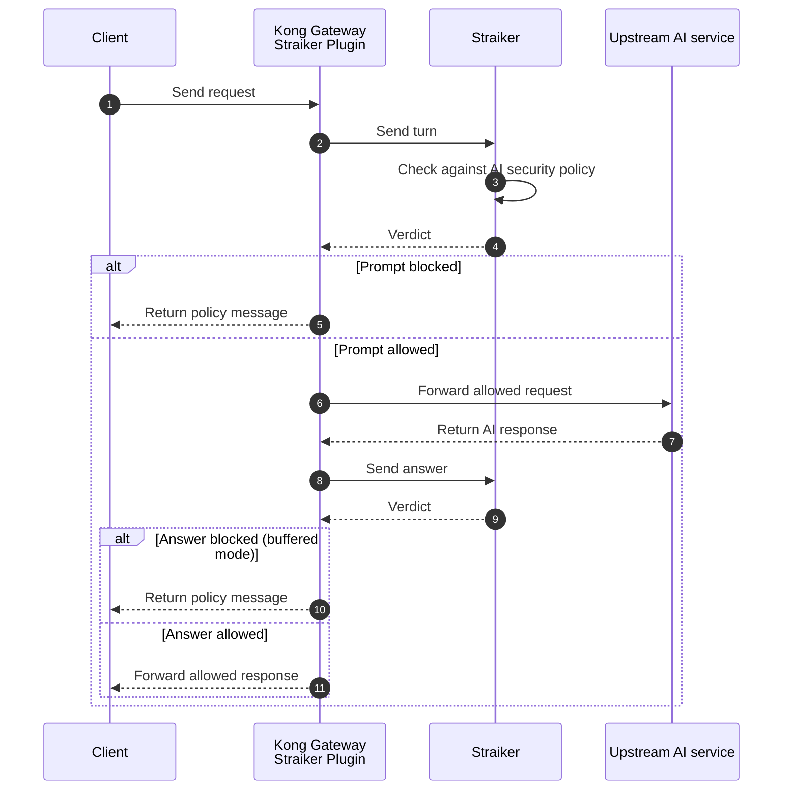

<!-- markdownlint-disable MD025 -->

# Straiker AI Security Plugin

The Straiker AI Security plugin (`straiker`) protects LLM traffic flowing through Kong Gateway. It scans prompts before they reach the upstream model and scans model responses before they return to the client.

One plugin covers both traffic shapes. It speaks Anthropic Messages and OpenAI chat, so the same plugin protects chat applications and coding agents such as Claude Code.

The plugin sends each turn to Straiker, which evaluates it against the policies configured in the Straiker Console and returns a verdict. Based on that verdict Kong forwards the traffic or replaces it with a policy message at the gateway.

Integrating Straiker with Kong Gateway allows you to:

- Block prompt injection, jailbreaks, sensitive data exposure, and unsafe model output at the gateway.
- Inspect indirect prompt injection — poisoned tool results arriving from a coding agent's local tool run.
- Stop a model's tool call before the agent executes it, on routes configured for it.
- Centralize AI security enforcement across applications, models, and providers.
- Hold the upstream model credential at the gateway so clients never carry a platform key.
- Inspect streaming and multimodal AI traffic without adding an application SDK.

## Delivery mode

The plugin enforces in one of two modes, selected by the `STRAIKER_KONG_MODE` environment variable on the Kong node:

| | `buffered` (default) | `streaming` |
| --- | --- | --- |
| Prompt and tool-result enforcement | Yes | Yes |
| Stops a tool call before the client runs it | Yes | No |
| Tokens reach the client as produced | No | Yes |
| Time to first token | The completion time | Unchanged |
| Typical route | CI, automation, unattended agents | Interactive developers |

It is an environment variable rather than a configuration field because Kong refuses a plugin that implements both the `response` and `body_filter` phases, and inspects the handler table at load time — before any configuration is read. The mode therefore decides the shape of the plugin, and it applies to the whole node. Run two node pools if you need both modes.

> The plugin does not require [AI Proxy](https://developer.konghq.com/plugins/ai-proxy/); it proxies provider traffic directly and injects the upstream credential itself.
>
> If you do use AI Proxy, keep it off nodes running `STRAIKER_KONG_MODE=buffered`. AI Proxy turns response buffering off whenever the client streams, which means the plugin's response phase never runs and enforcement stops silently. Use `streaming` mode on those routes instead.

## How it works

In the access phase:

1. **Credential injection:** The plugin replaces the client's upstream credential with the one the gateway holds.
1. **Request interception:** It captures the incoming request body.
1. **Security scan:** It sends the turn to Straiker for policy evaluation.
1. **Verdict enforcement:** Kong blocks the request or forwards it to the upstream model.

On the way back:

1. **Response capture:** The plugin captures the model's answer — held inline in `buffered` mode, relayed after delivery in `streaming` mode.
1. **Response scan:** It sends the answer to Straiker for evaluation.
1. **Final delivery:** In `buffered` mode Kong replaces the answer if the verdict is a block. In `streaming` mode the client already has the bytes and the verdict is advisory.



A block is returned as HTTP **200** carrying a completed assistant turn whose content is the policy text. It is deliberately not a 4xx or 5xx: coding-agent clients treat 403 as an authentication failure and retry 5xx. Alert on the `x-straiker-verdict` response header rather than on HTTP status.

## Install the Straiker AI Security plugin

Supported on self-managed Kong Gateway, Konnect hybrid deployments with self-managed data planes, and Konnect Dedicated Cloud Gateways. Konnect Serverless Gateways do not support custom plugins.

### Prerequisites

- Kong Gateway 3.14 or later.
- A Straiker account and integration key.
- Network egress from Kong data planes to the Straiker detect endpoint.
- `nginx_http_client_body_buffer_size` raised to `32m`. At nginx's 8 KB default a large request body spills to a temporary file, the plugin cannot read it, and traffic proxies uninspected.

### Docker

```dockerfile
FROM kong/kong-gateway:3.15
USER root
COPY kong/plugins/straiker/ /usr/local/share/lua/5.1/kong/plugins/straiker/
USER kong
ENV KONG_PLUGINS=bundled,straiker
ENV STRAIKER_KONG_MODE=buffered
ENV KONG_NGINX_HTTP_CLIENT_BODY_BUFFER_SIZE=32m
ENV KONG_NGINX_HTTP_CLIENT_MAX_BODY_SIZE=64m
```

Keep `bundled` in `KONG_PLUGINS`. Omitting it replaces the enabled set and silently drops every bundled plugin.

### LuaRocks

```sh
luarocks install kong-plugin-straiker
export KONG_PLUGINS=bundled,straiker
kong reload
```

### Konnect hybrid

Upload `schema.lua` to the control plane, then install the rock or image on every data plane node:

```sh
curl -i -X POST \
  "https://us.api.konghq.com/v2/control-planes/${CONTROL_PLANE_ID}/core-entities/plugin-schemas" \
  --header "Authorization: Bearer ${KONNECT_TOKEN}" \
  --header "Content-Type: application/json" \
  --data "{\"lua_schema\": $(jq -Rs '.' kong/plugins/straiker/schema.lua)}"
```

### Konnect Dedicated Cloud Gateways

Dedicated Cloud Gateways stream the plugin from the control plane, so nothing is installed on a data plane. The plugin is exactly one `handler.lua` and one `schema.lua` with no sibling modules and no `require()` in the schema, which is the shape streamed custom plugins accept.

Set `KONG_UNTRUSTED_LUA=lax` when creating the gateway. Kong's default is `strict`, which permits no network module, and the plugin will not load.

See the [repository README](https://github.com/straiker-ai/kong) for the upload command and the full set of constraints.

## Enable the plugin

Attach `straiker` to the route carrying LLM traffic. The plugin scores any POST on that route and does not inspect the path, so scope the route deliberately — a plain Kong path is a prefix match.

### decK

```yaml
_format_version: "3.0"
services:
  - name: anthropic
    url: https://api.anthropic.com
    read_timeout: 600000
    routes:
      - name: messages
        paths: ["~/v1/messages$"]
        strip_path: false
        protocols: ["http", "https"]
        plugins:
          - name: straiker
            config:
              detect_url: https://api.prod.straiker.ai/api/v3/detect
              api_key: "{vault://env/straiker-api-key}"
              upstream_api_key: "{vault://env/anthropic-api-key}"
```

Declare `protocols` explicitly. Without it Kong infers them from the service URL, an `https://` upstream makes the route HTTPS-only, and plain HTTP is rejected with `426 Upgrade Required` before any plugin runs.

### Admin API

```sh
curl -i -X POST http://localhost:8001/routes/messages/plugins \
  --header "Content-Type: application/json" \
  --data '{
    "name": "straiker",
    "config": {
      "detect_url": "https://api.prod.straiker.ai/api/v3/detect",
      "api_key": "'"${STRAIKER_API_KEY}"'"
    }
  }'
```

### Konnect API

```sh
curl -i -X POST \
  "https://us.api.konghq.com/v2/control-planes/${CONTROL_PLANE_ID}/core-entities/routes/${ROUTE_ID}/plugins" \
  --header "Authorization: Bearer ${KONNECT_TOKEN}" \
  --header "Content-Type: application/json" \
  --data '{
    "name": "straiker",
    "config": {
      "detect_url": "https://api.prod.straiker.ai/api/v3/detect",
      "api_key": "'"${STRAIKER_API_KEY}"'"
    }
  }'
```

## Configuration

| Parameter | Required | Default | Description |
| --- | --- | --- | --- |
| `detect_url` | Yes | | Straiker detect endpoint. Vault-referenceable. |
| `api_key` | Yes | | Straiker integration key. Vault-referenceable. |
| `timeout_ms` | No | `8000` | Timeout for a synchronous scoring call. |
| `fail_closed` | No | `false` | Reject traffic when Straiker cannot be reached. When false, traffic passes and the response is stamped `degraded`. |
| `score_request` | No | `true` | Score the prompt. Turn off on non-inference paths such as token counting. |
| `score_response` | No | `true` | Score the model's answer. |
| `max_body_bytes` | No | `10485760` | Skip scoring above this size. |
| `upstream_api_key` | No | | Model credential the gateway holds, injected on the way out. Vault-referenceable. |
| `upstream_key_header` | No | `x-api-key` | Header carrying it. Use `authorization` for OpenAI-style providers. |
| `user_ref` | No | | Attribution for turns on this route. Vault-referenceable. |
| `session_from_body` | No | `true` | Derive a stable session id when the client sends no session header. |
| `debug_preamble` | No | `false` | Log the system-prompt shape to explain client resolution. Prints prompt content to the Kong log. |
| `client` | No | | Names the client on a single-application route. Leave unset on a shared gateway. |
| `agent_ref` | No | | Names one agent. Scope it to a route. |
| `format_hint` | No | | `anthropic.messages` or `openai.chat`. Only used to resolve an ambiguous messages array. |

## Test the plugin

```sh
curl -i -X POST http://localhost:8000/v1/messages \
  --header "Content-Type: application/json" \
  --data '{
    "model": "claude-sonnet-4-5-20250929",
    "max_tokens": 256,
    "system": "You are a helpful assistant.",
    "messages": [
      { "role": "user", "content": "What is the capital of France?" }
    ]
  }'
```

Expect HTTP 200 and `x-straiker-verdict: allow`.

If a request violates a blocking policy, Kong returns the policy message and the upstream model is not called. If the policy is in detect-only mode, the request continues, the response is stamped `detect`, and the event appears in the Straiker Console for review.

Keep `max_tokens` generous while testing: a reply truncated at `stop_reason: max_tokens` resembles a block at a glance.

## Verdict header

| `x-straiker-verdict` | Meaning |
| --- | --- |
| `allow` | Scored, nothing fired |
| `detect` | A control fired while the tenant is in detect mode. Not a block |
| `block` | Enforced; the answer was replaced |
| `degraded` | Straiker unreachable or errored and `fail_closed` is false, so traffic passed uninspected |
| `unknown` | Straiker answered in an unrecognized shape; also uninspected |

Alert on `degraded` and `unknown`. Both return a healthy-looking 200 while the control is not running.

## Troubleshooting

### Plugin not found

If Kong returns `plugin 'straiker' not enabled`, check that the plugin files are installed on every data plane node, `KONG_PLUGINS` includes `straiker` and `bundled`, Kong was restarted, and in Konnect hybrid that the schema was uploaded to the control plane.

### 426 Upgrade Required and no verdict header

The route has no `protocols`, so Kong inferred HTTPS-only from the service URL and rejected the request at routing before any plugin phase ran. Add `protocols: ["http", "https"]`.

### No events in Straiker

Verify `api_key` is valid for the environment `detect_url` points at, and that data planes can reach that endpoint. Set `debug_preamble: true` temporarily and check Kong logs for `[straiker]` messages, then turn it off.

### Verdict is `degraded` or `unknown`

`degraded` means Straiker was unreachable or returned an error; check egress, the key, and `timeout_ms`. `unknown` means the response could not be interpreted; check that `detect_url` points at a supported API version.

### Large multimodal requests fail

Inline images and PDFs increase request size because they are base64 encoded. Raise Kong's request body buffer and maximum body size.

## Limitations

- Konnect Serverless Gateways do not support custom plugins.
- On Dedicated Cloud Gateways the plugin requires `KONG_UNTRUSTED_LUA` set to `lax` or `on`.
- The delivery mode is set per node, not per route.
- `streaming` mode cannot stop a tool call before it runs; `buffered` mode makes time to first token equal to the completion time.
- `buffered` mode is incompatible with AI Proxy on streaming requests.
- Synchronous scoring adds latency to the request path.
- Attribution is per route: `user_ref` is a static value and is not derived from the Kong Consumer.

## Security considerations

- Store `api_key` and `upstream_api_key` as Kong Vault references. Both fields are vault-referenceable.
- Keep `debug_preamble` false in production; it writes prompt content to the node's error log.
- Use TLS egress to Straiker.
- Alert on `degraded` and `unknown` verdicts so a degraded control is visible.
- Start with detect-only controls in the Straiker Console before enabling blocking for production applications.
- Review blocked and detected events regularly in the Straiker Console.

## Related resources

- [Straiker](https://straiker.ai)
- [Kong AI Gateway](https://developer.konghq.com/ai-gateway/)
- [Kong custom plugins](https://developer.konghq.com/custom-plugins/)
