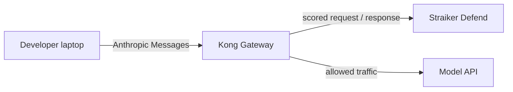

<!-- markdownlint-disable MD025 -->

# Straiker + Kong: what you get

As teams route more of their builder and agent traffic through Kong AI Gateway, Straiker Defend secures it. One plugin on the route, and every AI call is checked and blocked at the gateway, with no SDK in your apps.

There are two shapes of traffic, and a plugin for each:

| | Chat applications | Coding agents (Claude Code and similar) |
| --- | --- | --- |
| Plugin | `straiker` | `straiker-coding-agent-streaming` or `straiker-coding-agent-buffered` |
| What you stop | Prompt injection, data leakage, unsafe output | Prompts, poisoned tool results, and (buffered) tool calls before they run |

Pick the plugin in the [README](../README.md). The rest of this page is the security value of putting Straiker Defend on Kong.

## Coding agents on the gateway

Tools run on the developer laptop, but every model call crosses the gateway — so Kong is a single control point for agent traffic, with nothing to install on developer machines. It also sees activity that endpoint instrumentation can miss: tool calls that fail, and `@`-mention file reads that never become a tool call.

Use **streaming** on interactive developer routes. Use **buffered** on CI and unattended agents when a denied `Bash` / `Write` must never reach the client.

## One place to route, discover, and secure your AI traffic

Send your AI traffic through Kong. Discover AI auto-discovers the apps and agents sending that traffic and enumerates them for you. Defend AI puts blocking guardrails on each.

## Guardrails against the attacks that matter

On the traffic that flows through Kong, the plugin checks the prompt on the way in and the response on the way out, and blocks at the gateway.

**Prompt and content attacks**

- Multimodal attacks hidden in images, documents, PDFs, and other attachments
- Prompt injection and jailbreaks
- Indirect prompt injection
- Data leakage: PII, financial data, intellectual property, secrets, and credentials
- Improper output handling (LAVA): unsafe model output, such as exploit code that could compromise a downstream app

**Behavior across a session**

- User behavior analysis: a spike of findings from one user can mean account compromise, an insider threat, or a prompt-injection campaign run under that user's identity

Beyond these, you can author custom controls for the policies and sensitive data specific to your business.

## Across the Straiker platform

Straiker Defend AI goes further once it has visibility into what an agent does, not only what it says. That includes tool misuse, remote code execution, data exfiltration, resource exhaustion, system file access, destructive actions, and suspicious outbound access.

## Governance visibility, not only security

Alongside security findings, Straiker surfaces governance findings. You see how your AI is being used and who is using it, not only when it is attacked.

## How this is different

- **We see more than text.** Straiker inspects the images, documents, PDFs, and attachments flowing through the gateway, where attacks increasingly hide.
- **High-signal blocks, not alert noise.** Straiker pairs an ensemble of model detectors with deterministic checks and tunable sensitivity, so it can run in blocking mode without drowning your team in false positives.
- **You define what matters.** Out-of-the-box controls cover the common attacks, and custom controls cover the policies, data, and risks specific to your business.
- **Discover, Ascend, and Defend from one platform.** Straiker finds the apps and agents on your gateway, red-teams them on demand, and guards them at runtime.

## Red-team it before an attacker does

Guardrails protect live traffic. When you want to go further, Straiker Ascend AI red-teams an application the way a real adversary would. It is a separate offering. Send the app to Straiker, we attack it, and the findings become guardrails you enforce through Kong.
